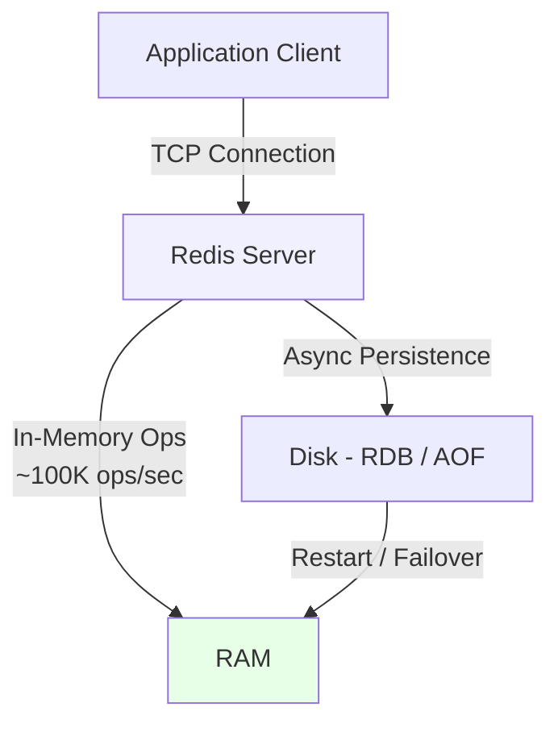
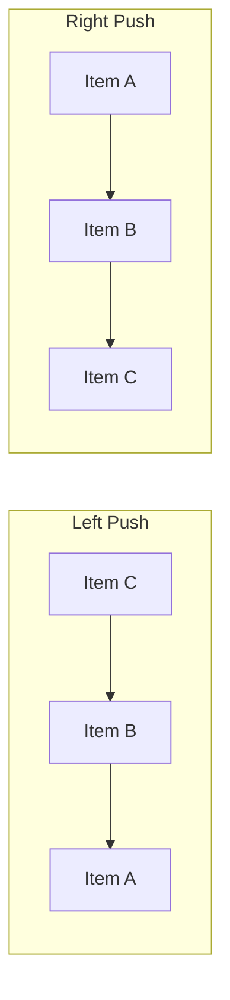
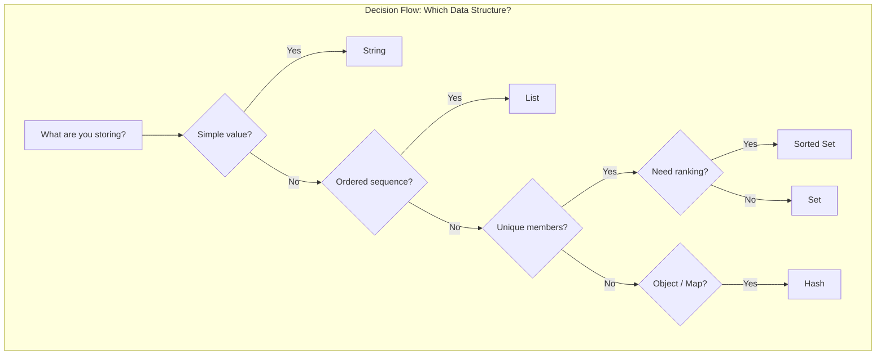
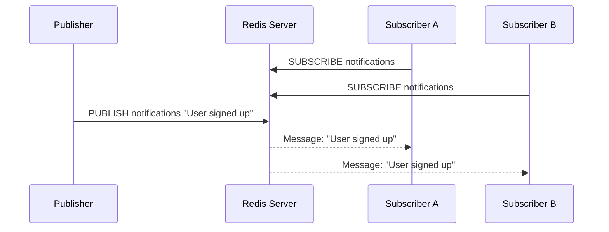

# A Beginner's Guide to Redis: The Fast In-Memory Database

Redis is an in-memory data structure store that functions as a database, cache, and message broker. Following in the footsteps of other NoSQL databases like MongoDB and Cassandra, Redis allows you to store massive amounts of data without the strict limitations of a traditional relational database.

> **Key insight:** Redis isn't just a cache. It's a full-featured data structure server that can replace multiple infrastructure components.

---

## Why is Redis So Fast?

The secret to Redis's incredible speed is that it stores its entire dataset in primary memory. Because of this, it is exceptionally fast — capable of handling up to 110,000 writes and 81,000 reads per second on modest hardware. All Redis operations are atomic, which ensures that concurrent access from multiple clients is handled safely with the most updated values.

Despite living in memory, Redis still offers data persistence by asynchronously saving changes to disk based on flexible time and update policies.



**How it works at the wire level:** Redis uses a single-threaded event loop (since v2.4) multiplexed over I/O. This means no locks, no context switching overhead, and predictable sub-millisecond latency. The tradeoff? A single slow command (like `KEYS *`) blocks everything.

---

## Core Data Structures

Redis natively supports a rich variety of data types. Choosing the right one is the difference between elegant 10-line solutions and tangled messes.

### Strings — The Foundation

The simplest data type, operates on basic key-value pairs. You can set a string, retrieve it, or even store integers and atomically increment them.

| Command | Example | What it does |
|---------|---------|-------------|
| `SET` | `SET name "shabir"` | Store a value |
| `GET` | `GET name` | Retrieve a value |
| `INCR` | `INCR pageview:123` | Atomic increment (even if 100 clients call it at once) |
| `MSET` | `MSET a 1 b 2 c 3` | Set multiple keys in one round trip |

**Edge case:** `INCR` on a non-integer string returns an error. Always validate or use `INCRBYFLOAT` for decimal values.

### Lists — Ordered Collections

Ordered collections of strings. Push items to the top using `LPUSH` or to the bottom using `RPUSH`. Pop from either end with `LPOP` / `RPOP`.



**Real-world use:** Task queues, rate-limiting logs, chat message history. `BLPOP` blocks until an element is available — perfect for worker queues.

### Sets — Uniqueness Guaranteed

Collections that store only unique values. Duplicates are silently ignored. Redis computes differences, intersections, or unions between sets server-side.

| Command | Purpose |
|---------|---------|
| `SADD` | Add members |
| `SINTER` | Intersection (e.g., "users who liked X AND Y") |
| `SUNION` | Union (e.g., "all users from either group") |
| `SPOP` | Random removal (good for raffles) |

### Sorted Sets — Leaderboards Built In

Every value gets a numerical score. Redis keeps elements sorted from min to max at all times — O(log N) for adds, O(1) for leaderboard queries.

**What makes them special:** You can query by rank range (`ZRANGE`), by score range (`ZRANGEBYSCORE`), or get the rank of any member. This is the data structure behind every leaderboard, priority queue, and rate limiter in production.

### Hashes — Object Storage

A map of string keys to string values. Perfect for storing objects without serializing the whole thing.

```
HSET user:1001 name "Alice" age 30 city "NYC"
HGET user:1001 name  → "Alice"
HGETALL user:1001    → all fields at once
```

> **Pro tip:** Use hashes instead of string serialization for objects. You get partial reads/writes, memory efficiency, and no serialization overhead.



---

## Powerful Advanced Features

### Pub/Sub Messaging

Redis supports a publisher-subscriber model where clients subscribe to specific channels. When other clients publish messages to those channels, subscribers receive them in real time.



**Production note:** Pub/Sub is fire-and-forget. If a subscriber disconnects, messages are lost. For persistent messaging, use Redis Streams (v5.0+) or a dedicated message queue.

### HyperLogLog

A probabilistic data structure that counts unique values using ~12 KB of memory — regardless of how many items you count. It's not exact (0.81% standard error), but it's invaluable for counting daily active users, unique searches, or IP addresses at scale.

```
PFADD stats:2026-05-09 "user:1001" "user:1002" "user:1001"
PFCOUNT stats:2026-05-09  → 2
```

### Geospatial Data

Store locations as longitude/latitude pairs. Redis computes distances and radius queries natively:

```
GEOADD locations 13.361389 38.115556 "Palermo"
GEODIST locations "Palermo" "Catania" km  → 166.2742
GEORADIUS locations 15 37 100 km  → finds points within 100 km
```

### Transactions with MULTI/EXEC

Queue commands to execute atomically:

```
MULTI
INCR counter
SET status "processed"
EXEC
```

No other client can interleave while the transaction runs. But this is NOT a traditional database transaction — there's no rollback. If one command fails, the rest still execute.

---

## Production Considerations

This is where most beginner guides stop. Here's what you actually need to know.

### Persistence Tradeoffs

| Feature | RDB (snapshots) | AOF (append-only) |
|---------|----------------|-------------------|
| Data loss window | Up to last save interval | 1 second (default) or 1 write (always) |
| File size | Compact | Larger |
| Restart speed | Fast | Slow (replays all commands) |
| Overhead | Periodic fork | Continuous writes |

**Recommendation:** Use both. RDB for fast restarts, AOF for durability. Or disable persistence entirely if you're a pure cache (data re-buildable from source).

### Eviction Policies

When memory fills up, Redis evicts keys based on policy:

| Policy | Behavior |
|--------|----------|
| `noeviction` | Return errors on writes |
| `allkeys-lru` | Evict least recently used keys |
| `volatile-lru` | Evict LRU among keys with TTL set |
| `allkeys-lfu` | Evict least frequently used keys (v4.0+) |

> **Key insight:** Default is `noeviction`. In production, set `maxmemory-policy allkeys-lru` unless you have a specific reason not to.

### Security

- Redis has no authentication by default. Set `requirepass` immediately.
- Use `rename-command` to disable dangerous commands (`KEYS`, `FLUSHALL`, `CONFIG`) in production.
- Never expose Redis to the public internet. Use a firewall or TLS (via Redis 6+ built-in TLS or a proxy like stunnel).
- Consider `ACL` rules (Redis 6+) for per-user permissions.

### When NOT to Use Redis

- **Large datasets that don't fit in RAM** — Redis requires all data in memory. Use a disk-based DB for terabytes.
- **Complex queries** — Redis has no query planner, no joins, no secondary indexes beyond its native structures.
- **Strong consistency requirements** — Redis replication is async by default. You can lose acknowledged writes on a master failure.
- **Persistent long-term storage** — While Redis persists, it's not designed for 10-year archival. Dump to a real DB.

---

## Common Mistakes Beginners Make

1. **Using `KEYS *` in production** — blocks Redis for seconds/minutes on large datasets. Use `SCAN` instead.
2. **Storing serialized JSON in strings** — you lose partial access. Use hashes for objects.
3. **Ignoring memory** — one `SMEMBERS` on a set of millions can OOM your Redis. Use `SSCAN`.
4. **No eviction policy configured** — your app crashes with OOM errors at 3 AM.
5. **Using the same Redis for cache AND persistent data** — eviction might delete data you thought was safe.

---

## Final Takeaways

- Redis is fast because it's in-memory and single-threaded — design around those two facts.
- Choose data structures deliberately. Each one solves a specific problem.
- Enable persistence and configure eviction before going to production.
- Redis is a specialized tool — use it for speed, not as a primary database.
- The CLI is your friend. Install `redis-cli` and experiment.

> **Bottom line:** Redis is one of the most versatile tools in a backend engineer's toolkit. Learn the data structures, respect the constraints, and it will serve you for years. Mistake it for a general-purpose database, and it will hurt you.

---

*First paragraph acts as cover subtitle: A practical guide to Redis covering data structures, advanced features, production deployment, and when to avoid it.*
